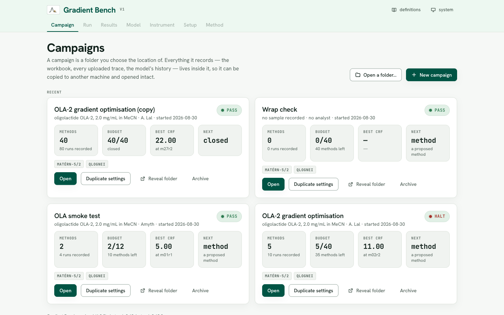
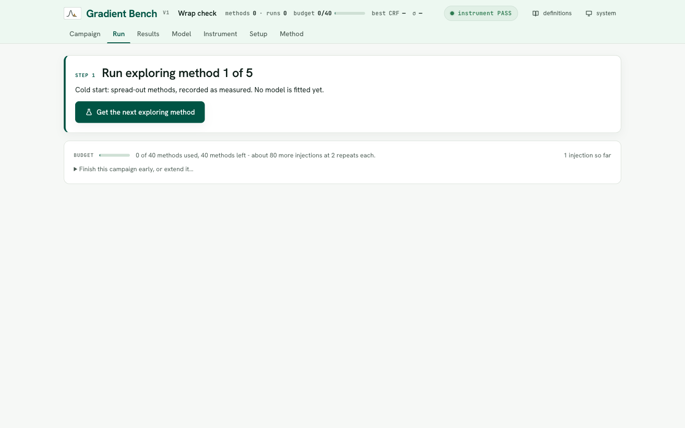
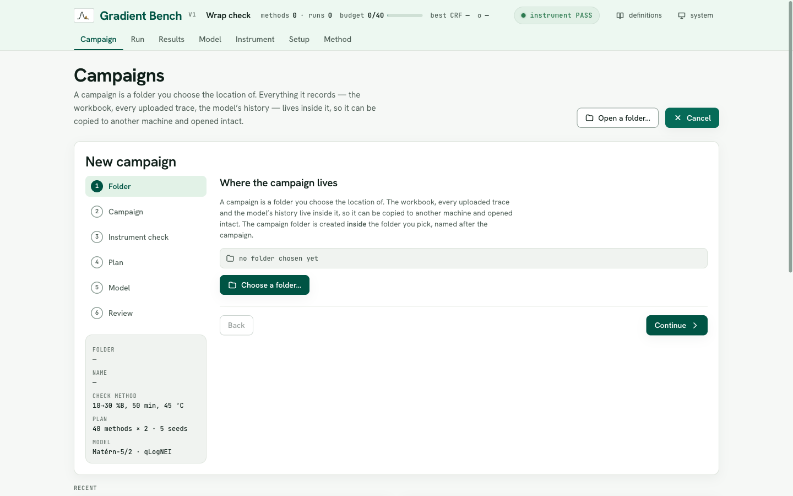
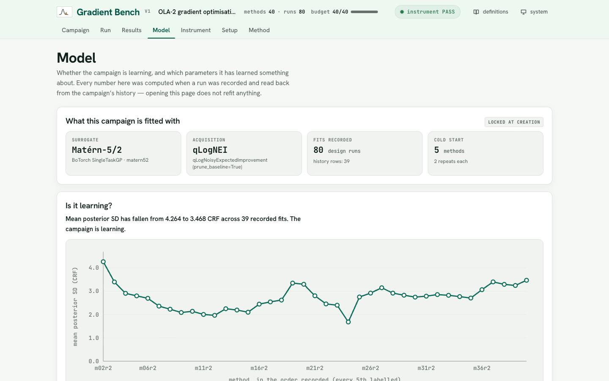
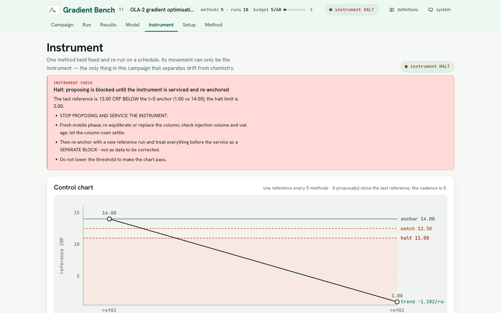
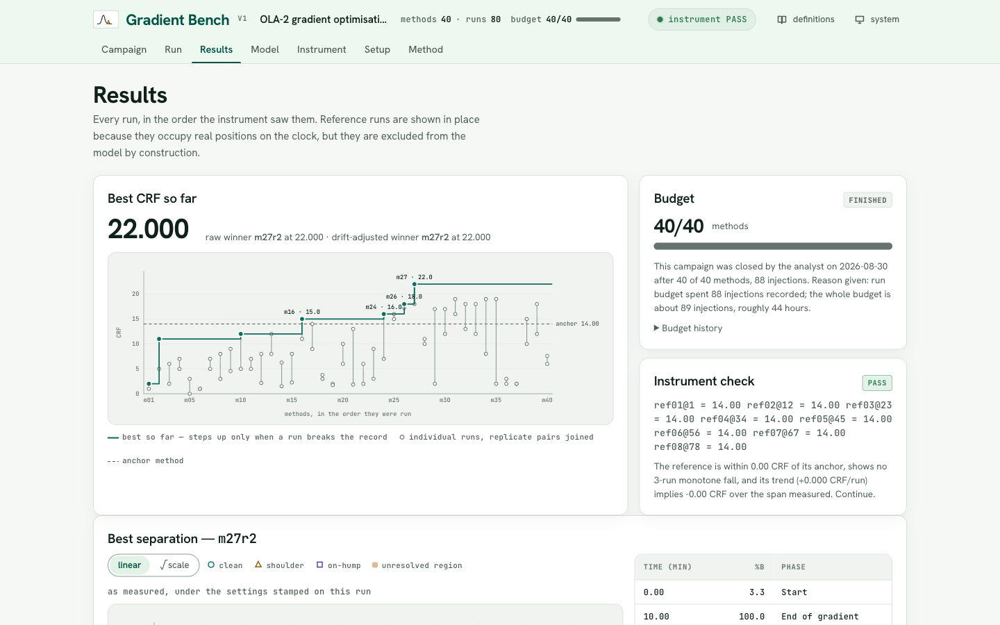

# Gradient Bench

**Closed-loop HPLC gradient method development.** The app proposes a gradient method, you
run it on the instrument, upload the trace, and confirm the peaks it found. It records the
result, refits its model, and proposes the next method — while a control chart watches the
instrument itself for drift.

It is a single Flask app with a pre-built React interface. No database, no account, no
network: nothing loads from a CDN and both fonts are vendored, because the PC next to an
HPLC often has no internet.



---

## Why it exists

Developing a gradient method is a search. Four knobs — where the gradient starts, where it
ends, how long it takes, and how hot the column runs — interact, and each candidate costs a
real injection and 15–60 minutes of instrument time. A 40-method campaign is roughly **89
injections and 44 hours of bench time**, so the search has to be sample-efficient, and every
run has to be worth its place.

Two things usually go wrong with that search:

1. **The score drifts with the instrument, not the chemistry.** A column ageing mid-campaign
   makes late methods look worse than early ones, and the optimiser dutifully learns the
   wrong lesson.
2. **Nobody can reconstruct what happened.** Three weeks later the winning method exists,
   but not the reason it won.

Gradient Bench answers both by construction. One fixed instrument-check method is re-run on
a schedule and is the only thing allowed to explain drift; and a campaign is a **folder** —
the workbook, every uploaded chromatogram, and the model's own history live inside it, so it
can be copied to another machine and opened intact.

---

## The loop

Every cycle is the same four moves. The app never shows you two things to do at once.



1. **Get the method.** The app names one: a gradient table, a column temperature, and how
   many times to inject it. Early on these are spread-out exploring methods; once the model
   is fitted, each comes with a prediction and an uncertainty.
2. **Run it** on the instrument, unchanged.
3. **Upload the trace** — the ASCII `.txt` your data system exports (time, signal).
4. **Check the peaks.** The picker classifies each peak as clean, shoulder or on-hump, and
   marks unresolved regions. You correct it if it is wrong, then record.

Recording writes the run to the workbook, re-fits the surrogate, and serves the next method.
Every fifth method the app interrupts to ask for the instrument check instead.

---

## Install

Python 3.9 or newer, and about **3 GB of disk** — almost all of it `torch`. Nothing else:
no Node, no database, no account.

```bash
git clone https://github.com/amyth-create/gradient-bench.git
cd gradient-bench
python3 -m venv .venv
source .venv/bin/activate                 # Windows: .venv\Scripts\activate
pip install -r gradient_bench/requirements.txt
```

`torch` and BoTorch are needed to **propose** a method, not to **record** one. Without them
the app still opens campaigns, picks peaks, scores traces and writes results — only the
*next method* button stops working.

Confirm the install before trusting it:

```bash
python -m gradient_bench.scripts.verify_install    # says what is missing and what to do
python -m pytest gradient_bench/tests -q           # expect 130 passed
```

### Run it

```bash
python -m gradient_bench.api.app                   # http://127.0.0.1:5051
python -m gradient_bench.api.app --port 8000       # or pick a port
python -m gradient_bench.api.app --open /path/to/a/campaign
```

The frontend is pre-built into `gradient_bench/api/static/`, so nothing needs Node. To
change the interface you will need it:

```bash
cd frontend && npm install && npm run build        # builds into ../gradient_bench/api/static
npm run dev                                        # dev server, proxies /api to :5051
```

---

## Your first campaign

Press **New campaign**. A six-step wizard asks for the folder, the campaign, the instrument
check, the plan, the model, and then shows you everything before it creates anything. A
summary rail on the left keeps the whole decision visible as you go.



You will be asked for six **material facts** — sample, column, mobile phase, instrument,
flow rate and detector. They are material because changing one later means the earlier and
later runs are no longer the same experiment; the app will let you do it, but it makes you
give a reason and writes that to the record.

Then the plan:

| Setting | Default | What it costs |
|---|---|---|
| Run budget | 40 methods | unique methods, not injections |
| Repeat runs per method | 2 | the only way σ can be measured directly |
| Exploring runs before the model starts | 5 | spread-out methods, recorded as measured |

The wizard states the bench-time cost of the plan — injections and hours — before anything
exists. The budget can be extended later, with a reason, on the record.

**The anchor comes first.** Nothing else is served until the instrument-check method has
been run and recorded at t = 0. Without it, every later reference is a difference from
nothing.

---

## Under the hood

### The objective

One number, maximised, frozen at version 1.0.0:

```
CRF = n_clean_peaks × (1 − hump_time_fraction)²
```

`n_clean_peaks` is how many peaks came back cleanly resolved. `hump_time_fraction` is the
share of the run sitting under an unresolved region. It is **squared on purpose**: the
penalty barely registers until a hump takes a real share of the run, then bites hard.

Only those two measurements may reach the objective. The other 15 trace-health descriptors
recorded on every run are *structurally barred* from it — an assertion runs on every
analysis and fails loudly if one of them ever reaches the score. They exist to diagnose the
instrument; they must never score the chemistry.

### The design space

Four controllable parameters, a box, and one linear constraint:

| Parameter | Range | |
|---|---|---|
| `start_phi` | 0.02 – 0.40 | starting %B, as a fraction |
| `end_phi` | 0.10 – 1.00 | final %B |
| `duration_min` | 10 – 60 min | gradient length |
| `T` | 25 – 60 °C | column temperature |

The constraint is `end_phi >= start_phi`. The minimum span is **zero on purpose**:
`end_phi == start_phi` is an isocratic method, which is a legitimate answer the optimiser is
allowed to reach. The constraint is handed to the acquisition optimiser natively rather than
by rejection sampling, so proposals are feasible by construction.

### The surrogate and the acquisition

A Gaussian process over those four normalised parameters, built through BoTorch's own
constructors so its dimension-scaled LogNormal lengthscale priors are preserved. Both
choices are made **once, at campaign creation, and then locked** — a campaign fitted under
one kernel and re-fitted under another is not the same campaign.

| Surrogate | | Acquisition | |
|---|---|---|---|
| `matern52` | Matérn-5/2 ARD *(default)* | `qlognei` | log noisy expected improvement *(default)* |
| `matern32` | Matérn-3/2 | `qlogei` | log expected improvement |
| `rbf` | squared exponential | `ucb` | upper confidence bound, `beta` you set and defend |
| `default` | whatever BoTorch installs | `logpi` | log probability of improvement |

The default pairing is qLogNEI on a Matérn-5/2 — noisy expected improvement because
replicates disagree and the incumbent is itself uncertain, and the log form because the
plain one underflows into a flat surface the optimiser cannot climb.

BoTorch is pinned to `>=0.18,<0.19` deliberately: its *default* kernel and priors changed
between releases. The resolved versions of every library are written into each campaign's
Config sheet.

### Noise, and why replicates are not optional

Two runs at identical settings differ only by noise. That is the only direct measurement of
σ available, which is why the default plan injects each method twice. The pooled replicate σ
is converted and installed as the model's noise floor, so the GP is never told the data is
cleaner than the instrument actually is.

The Model tab reports what it found and does not flatter it — including `floor_z`, which
says how much of the observed spread is just noise. When differences between methods are
marginal, it says so.



### The peak picker

A vendored, self-contained picker (`hplc_picker` 3.0.0) that defines what a peak *is*:
baseline correction, a prominence gate set as signal-to-noise × the noise estimate, then
classification into clean / shoulder / on-hump, plus detection of unresolved regions.

Three thresholds are exposed — the S/N gate, the hump floor ratio, and the minimum hump span
— each stating what raising and lowering it does. You can also drag across the trace to draw
an unresolved region by hand, which replaces automatic detection for that run.

Changing the picker campaign-wide **re-scores every stored trace**, so the CRF column keeps
meaning one thing for the life of the campaign.

### Drift, and the control chart

One method held fixed, re-run every fifth method. Its movement can only be the instrument —
that is the entire reason it exists.



Measured against the t = 0 anchor: **WATCH** at 1.5 CRF below it, **HALT** at 3.0 below, or
at three consecutive falls. On a halt the app stops proposing and tells you to service the
instrument and re-anchor, treating everything before the service as a separate block — not
as data to be corrected.

Six diagnostic channels (peak width, tailing, retention, signal and area, baseline and
noise, acquisition) are read from the reference runs only, and each reading is offered as a
hypothesis, not a diagnosis. One of them detects that the *acquisition itself* changed — a
different run length or sampling rate — which means the references are no longer measuring
the same thing and every other panel is reading across a discontinuity.

Drift-adjusted scores are available but **off by default**: adjusting assumes the drift is
reversible, and nothing can check that. It never changes what the model is fitted to. The GP
always sees raw scores.

---

## Reading the results

The Results tab is the ledger: every run in the order the instrument saw them, with
reference runs shown in place — they occupy real positions on the clock — but excluded from
the model by construction.



The record line steps up only when a run actually breaks the record, so the flat stretches
are visible: *how long since the last improvement* is exactly the evidence the "extend or
finish" decision needs.

Everything exports — a workbook and a PDF report, written into the campaign folder. The
**Method** tab assembles a full methods statement from the running code and the campaign's
own workbook, not from a page maintained by hand, and prints with its own masthead.

---

## What is in here

```
gradient_bench/          the app
  core/                  the science: space, optimiser, picker, CRF, drift, uncertainty
    space.py             4 parameters, the box, the linear constraint
    optimiser.py         SURROGATE_OPTIONS, ACQUISITION_OPTIONS, the GP fit
    hplc_picker.py       the only copy of the peak picker — it defines what a peak is
    crf.py               the objective, frozen
    drift.py             the control chart and its limits
  store/campaign.py      a campaign is a folder; the workbook is its record
  api/app.py             the Flask API and the pre-built frontend
  scripts/               verify_install, replay_corpus (headless)
  tests/                 130 tests, including golden files
frontend/                React source (Vite): tabs/, components/, styles/
testdata/                21 real chromatograms and their sheet
docs/screenshots/        the images in this README
```

`gradient_bench/core/hplc_picker.py` is the **only** copy of the picker; `hplc_picker.py` in
the root is a three-line shim so `import hplc_picker` keeps working. If you change the
picker, edit the copy in `core/` and re-run the tests.

## Tests

```bash
python -m pytest gradient_bench/tests -q                    # 130 passed
python -m gradient_bench.scripts.replay_corpus --trace-dir testdata/traces
```

`testdata/` holds real chromatograms and their sheet, so the golden-file tests and the
headless replay run straight out of this folder with nothing else installed.
